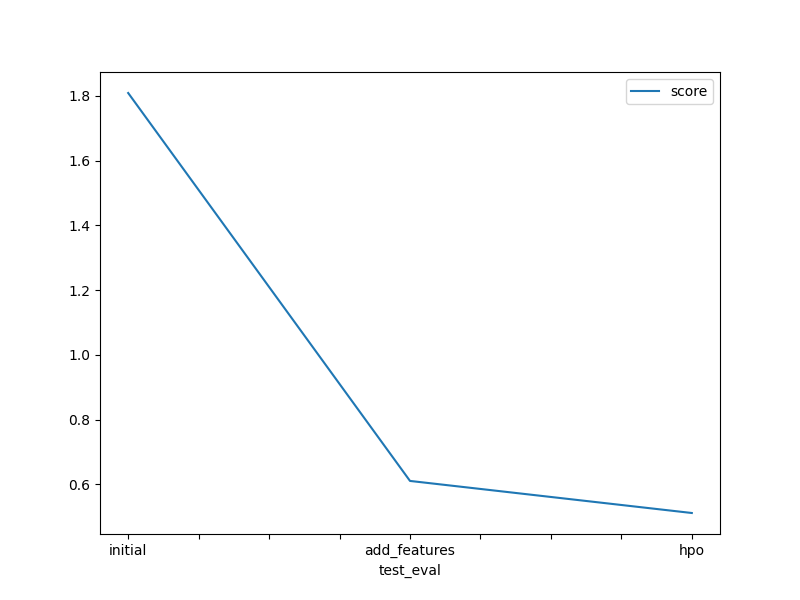

# Report: Predict Bike Sharing Demand with AutoGluon Solution
#### Vanessa Joan Chebet

## Initial Training
### What did you realize when you tried to submit your predictions? What changes were needed to the output of the predictor to submit your results?
Observations:
- Some prediction included negative results values.
- The submission was therefore not successful for this model prediction and resulted to errors.
Changes applied:
- There was need to replace the negative prediction values with 0, to make the values positive.

### What was the top ranked model that performed?
The top ranked model was add_features - WeightedEnsemble_L3 with a validation score of -30.3488 and Kaggle score of 0.61037.
This model was achieved through feature engineering without hyperparameter optimization.

## Exploratory data analysis and feature creation
### What did the exploratory analysis find and how did you add additional features?
Feature datetime was parsed as datetime feature to obtain detailed information
season and weather features were found to be integer values and needed to be tranformed to categorical data type since they are categorical features.
New features were then generated from the datetime feature as hour, day, month and year.
The new features were then added to both the train and test datasets.
Since casual and registered features were not present in the test dataset, they both were then ignored in the training.
It was also observed that the features, casual and registered were highly correlated to the count which is the target feature.
temp and atemp features were also seen to be highly correlated to each other and the recommendation is that atemp feature can be dropped in order to reduce multicollinearity.

### How much better did your model preform after adding additional features and why do you think that is?
Additional features improved the model as compared to the initial model.
Converting the categorical features intially declared as intergers helped improve the model performance since the model was able to use the right data types to perform prediction.
The multiple features generated from the datetime feature helped to improve the performance since the was more detail to assess the patterns in the data. 

## Hyper parameter tuning
### How much better did your model preform after trying different hyper parameters?
After performinf hyperparameter tuning, the model performed better than the initial model.
The Hyperparameter model had a better performance on the kaggle score although it was outperformed by the model with added features.

### If you were given more time with this dataset, where do you think you would spend more time?
Perform more feature engineering such as more feature extraction on the season and weather features to see the effect of seasonality on the prediction.
I would also perform more hyperparameter tuning with high qualilty presets.

### Create a table with the models you ran, the hyperparameters modified, and the kaggle score.
|model|gbm	|xt|xgb|score|
|--|--|--|--|--|
|initial|Default|Default|Default|1.80860|
|add_features|Default|Default|Default|0.61037|
|hpo|num_boost_round = 200, num_leaves = 50|'n_estimators':200, 'ag_args': 'name_suffix': 'RMSE', 'problem_types': ['regression']|'objective': 'reg:squarederror', 'eval_metric': 'rmse','max_depth':6, 'n_estimators': 200|0.51132|

### Create a line plot showing the top model score for the three (or more) training runs during the project.

### Create a line plot showing the top kaggle score for the three (or more) prediction submissions during the project.

## Summary
The top performing model showed improved prediction reesults after performing exploratory data analysis and feature engineering
Applying hyperparameter tuning with best quality presets produced improved performance from the intial model although, added_features model outperformed it.

